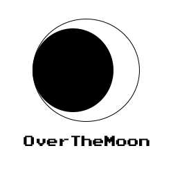

 <h2 align="center"> Over the Moon </h2>
 

  
 

This is an Android application I made for a school assignment. It provides the user information about the current rising, setting and distance of the moon, based on the users GPS-location!

This application has the following functionalities:
- Uses GPS-location to fetch localized API-data.
- Uses data from the IPGeolocation Astronomy-API.
- Available in Dutch and English
